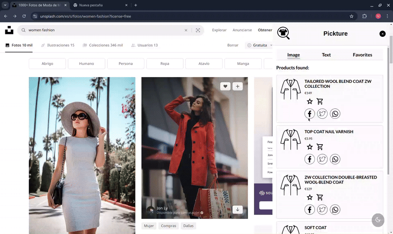

# Pickture 
#### HackUDC 2024
Pickture is a chrome web extension you can use to find those beautiful clothes you come across around the internet. With just one click on the image, several options similar to those clothes on the picture will appear in front of you to save or buy.

## Features
- Provides several Inditex substitution options for an outfit with just clicking over the image.
- There is also the option of introducing the desired item of clothing by typing it and even selecting the brand.
- Makes it possible to save your favorite products or just save them for later.
- Shows the current price of every product including discounts.
- Allows to access to the product page with just one click.
- Makes it easier to share a product on social media by just clicking a button.
- Counts with both day and night mode.
- We have a landing page with some information you can reach out at https://web-hackudc-1.vercel.app/#technology.

## How does it work?
Our extension takes the URL of the clicked image and sends it to the [Visual Search Inditex Tech API](https://developer.inditex.com/apimktplc/web/products/pubapimkt/protocols/REST/apis/visual-search/overview), an Open Source API that receives the image and answers with similar products from Inditex brands.

Besides, we use [IndexedDB](https://developer.mozilla.org/en-US/docs/Web/API/IndexedDB_API) to provide a persistent "Favorites Menu" to save products in between sessions. 

Moreover, the search can also be done by typing the desired product and even specifying the Inditex  brand thanks to the [Product Search Inditex Tech API](https://developer.inditex.com/apimktplc/web/products/pubapimkt/protocols/REST/apis/product-search/overview), so that no matter the situation, you will always find the product you want.

Finally, our landing page is actually hosted with [Vercel](https://vercel.com/).

All this was programmed with HTML, CSS and JavaScript and managed with [GitHub](https://github.com/).

## Deployment
Just download this repo, add a config.js with your own credentials in the extension directory, so that you can connect the APIs. Go to chrome://extensions/ in your chrome navigator and add this folder by clicking on "Load unpacked". Just like this, you will be able to try our extension.

## How to use
Even though the extension is based in a very simple interface, here are some tips for the first time.
- Right click over an image, and a context menu will appear with the "Search for similar clothes" (the option with our logo in it).
- Click the option, and a menu will appear on the right side of the page.
- Several products will appear after some time, when that happens you will be able to save the product on the Favorite menu (star icon), go to the product page (cart icon) or share it on social media (social media icons).
- Try out the other menus, including the text search.
- In the right down corner it is the dark mode button, for a calmer viewing experience. 

## Contributions
You can find all the necessary information in the CONTRIBUTING.md document. Please always follow the CODE_OF_CONDUCT.

## Licenses
- Icons and font (https://fonts.google.com) -> Open Source
- Facebook icon (https://www.svgrepo.com/svg/506656/facebook) -> MIT License
- Twitter icon (https://www.svgrepo.com/svg/519928/twitter) -> GPL License
- Whatsapp icon (https://www.svgrepo.com/svg/500461/whatsapp) -> MIT License
- Logo (https://inkscape.app/es/) -> GPL License

## Our license
We share this project under the Apache License 2.0. You can have more information about this license on the LICENSE section of the repository.
